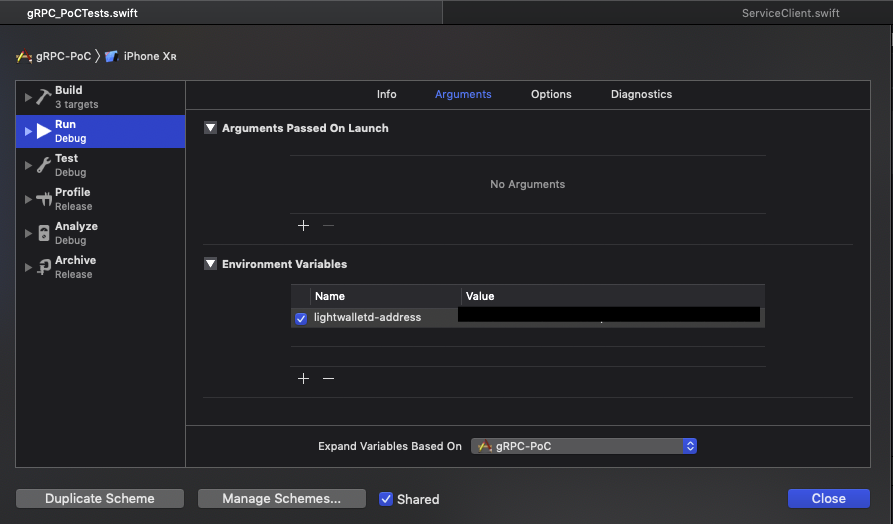

# gRPC POC - A gRPC Proof of concept

## Motivation 
test Swift-GRPC services using lightwalletd nodes

## Usage

### installing 
Clone and run ```pod install``` 

### setting it up
We don't like to commit address so the environment has to be set up from environment variables

If you take a look at the environment class, you will see that it will expect to get it from the ```LIGHTWALLETD-ADDRESS``` key.

Set the running scheme to pass that environment variable with the proper key



```` swift 
class Environment {
    static let lightwalletdKey = "LIGHTWALLETD-ADDRESS"
    static func launch() {
        guard let addr = ProcessInfo.processInfo.environment[lightwalletdKey] else {
            print("no lLIGHTWALLETD-ADDRESS set up!")
            return
        }
        
        UserDefaults.standard.set(addr, forKey: lightwalletdKey)
        UserDefaults.standard.synchronize()
    }
    
    static var address: String {
        UserDefaults.standard.object(forKey: lightwalletdKey) as? String ?? ""
    }
}
````

### Testing
You can verify that the environment is being set up properly by running the tests

```` swift 
 func testEnvironmentLaunch() {
        
        let address = gRPC_PoC.Environment.address
        
        XCTAssertFalse(address.isEmpty, "Your \'\(Environment.lightwalletdKey)\' key is missing from your launch environment variables")
    }
    
````


### Running it 
If you did everything correctly and your tests pass you should see this


Otherwise you will see this when running 


## Contributing
If you find any issues please create one. 

##License
Apache License Version 2.0 

